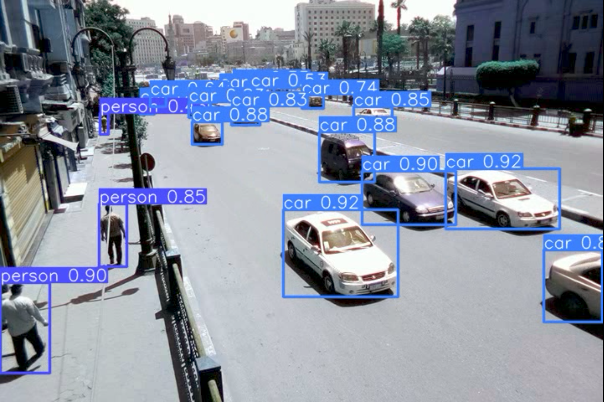
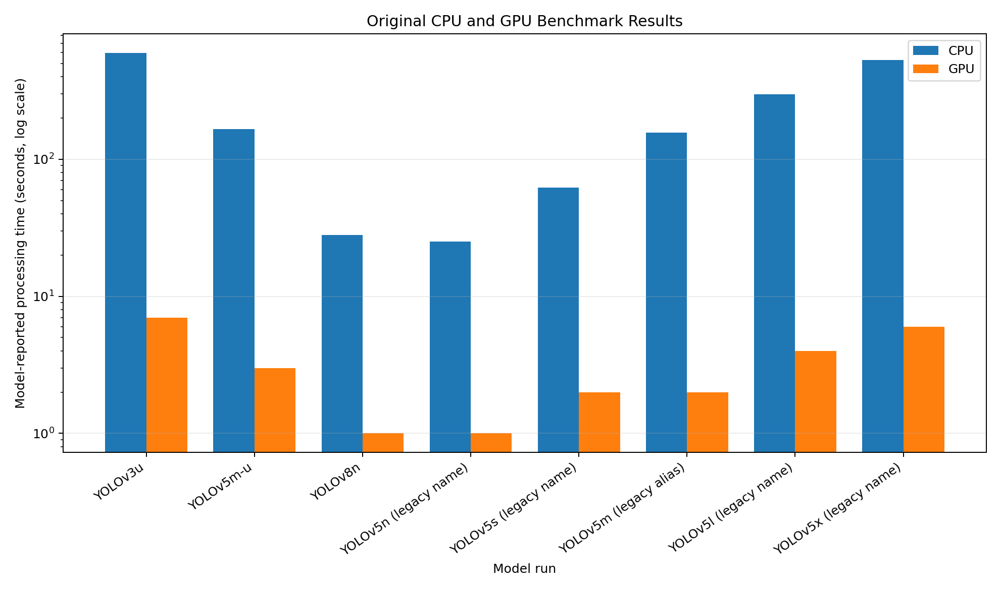

# YOLO Object Detection Benchmark

A reproducible benchmark comparing seven pretrained YOLO object-detection models on the same traffic video across CPU and GPU execution.

The project uses Ultralytics YOLO, PyTorch, and OpenCV to process every readable video frame, count detections, measure runtime, calculate end-to-end throughput, save annotated videos, and export the results to CSV.

[View the executed notebook on Kaggle](https://www.kaggle.com/code/marioyouchia/yolo-object-detection-benchmark)

## Benchmark Scope

The following pretrained models are compared:

- YOLOv3u
- YOLOv5n-u
- YOLOv5s-u
- YOLOv5m-u
- YOLOv5l-u
- YOLOv5x-u
- YOLOv8n

Each model is executed once on the CPU and once on the GPU using the same input video and inference pipeline.

This project evaluates inference behavior and computational performance. It does not train a custom detector.

## Detection Preview


YOLOv5x-u detections on a traffic frame containing nearby and distant vehicles.



A second annotated frame showing simultaneous vehicle and pedestrian detections.

## Runtime Comparison



Model-reported processing time for the CPU and GPU runs. A logarithmic vertical scale keeps the faster GPU measurements visible beside the longer CPU measurements.

## Executed Results

The executed Kaggle notebook used:

- NVIDIA Tesla T4 GPU
- PyTorch 2.10.0 with CUDA 12.8
- 145 readable video frames
- 720 × 480 video resolution
- 25 FPS source frame rate

| Model | Total frame detections | CPU wall time (s) | CPU wall FPS | GPU wall time (s) | GPU wall FPS |
|---|---:|---:|---:|---:|---:|
| YOLOv3u | 2,614 | 202.80 | 0.71 | 10.99 | 13.20 |
| YOLOv5n-u | 2,272 | 12.07 | 12.01 | 3.31 | 43.83 |
| YOLOv5s-u | 2,428 | 25.14 | 5.77 | 3.49 | 41.53 |
| YOLOv5m-u | 2,583 | 56.86 | 2.55 | 4.48 | 32.34 |
| YOLOv5l-u | 2,668 | 107.64 | 1.35 | 6.60 | 21.97 |
| YOLOv5x-u | 2,719 | 183.81 | 0.79 | 10.59 | 13.69 |
| YOLOv8n | 2,483 | 12.44 | 11.65 | 3.36 | 43.11 |

### Main observations

- YOLOv5n-u achieved the highest measured GPU wall throughput at approximately 43.83 FPS.
- YOLOv8n produced a similar GPU throughput of approximately 43.11 FPS.
- YOLOv5x-u produced the largest total number of frame-level detections.
- GPU execution substantially reduced processing time for every tested model.
- Larger models generally detected more objects but required more processing time.

`total_frame_detections` is the sum of all bounding boxes produced across all processed frames. It is not an accuracy metric because the project does not include ground-truth annotations.

## Measurements

The exported CSV includes:

- `model`: display name of the tested model
- `weight_reference`: pretrained weight filename
- `device`: CPU or GPU
- `frames`: number of processed frames
- `total_frame_detections`: total bounding boxes across all frames
- `model_time_seconds`: time reported by the model for preprocessing, inference, and postprocessing
- `wall_time_seconds`: complete elapsed processing time, including video reading, inference, annotation, and video writing
- `wall_fps`: processed frames divided by wall-clock time

## Repository Structure

```text
YOLO-Object-Detection-Benchmark/
├── README.md
├── yolo_object_detection_benchmark.ipynb
├── requirements.txt
├── data/
│   └── Test_sample_video.mp4
├── outputs/
│   ├── yolov3u.mp4
│   ├── yolov5nu.mp4
│   ├── yolov5su.mp4
│   ├── yolov5mu.mp4
│   ├── yolov5lu.mp4
│   ├── yolov5xu.mp4
│   └── yolov8n.mp4
├── results/
│   └── benchmark_results.csv
└── assets/
    ├── runtime-comparison.png
    ├── yolov5xu-detection-frame-01.png
    └── yolov5xu-detection-frame-02.png
```

## Running on Kaggle

1. Open the [executed Kaggle notebook](https://www.kaggle.com/code/marioyouchia/yolo-object-detection-benchmark).
2. Attach a Kaggle dataset containing `Test_sample_video.mp4`.
3. Enable a GPU accelerator.
4. Set the benchmark configuration:

```python
RUN_CPU = True
RUN_GPU = True
MAX_FRAMES = None
SAVE_ANNOTATED_VIDEOS = True
```

5. Run all notebook cells.

With both device flags enabled, each model is benchmarked once on the CPU and once on the GPU during the same notebook run.

## Running Locally

Create and activate a virtual environment, then install the dependencies:

```bash
python -m venv .venv
```

Windows:

```bash
.venv\Scripts\activate
```

Linux or macOS:

```bash
source .venv/bin/activate
```

Install the required packages:

```bash
pip install -r requirements.txt
```

Place the test video at:

```text
data/Test_sample_video.mp4
```

Then open and run:

```text
yolo_object_detection_benchmark.ipynb
```

The pretrained model weights are downloaded automatically by Ultralytics when they are first requested.

## Output Files

A complete run produces:

- one annotated output video per model;
- `results/benchmark_results.csv`;
- CPU and GPU runtime records;
- a runtime-comparison chart.

When CPU and GPU benchmarking are both enabled, the annotated videos are saved from the GPU pass to avoid creating visually identical duplicate videos.

## Source Video Limitation

The source MP4 metadata advertises more frames than can actually be decoded. OpenCV stops after 145 readable frames and reports that the file is partial or damaged.

The notebook detects this condition before benchmarking and processes only the readable frames. Therefore, all reported measurements and generated videos correspond to those 145 frames.

## Technologies

- Python
- Ultralytics YOLO
- PyTorch
- OpenCV
- pandas
- Matplotlib
- Jupyter Notebook
- Kaggle
