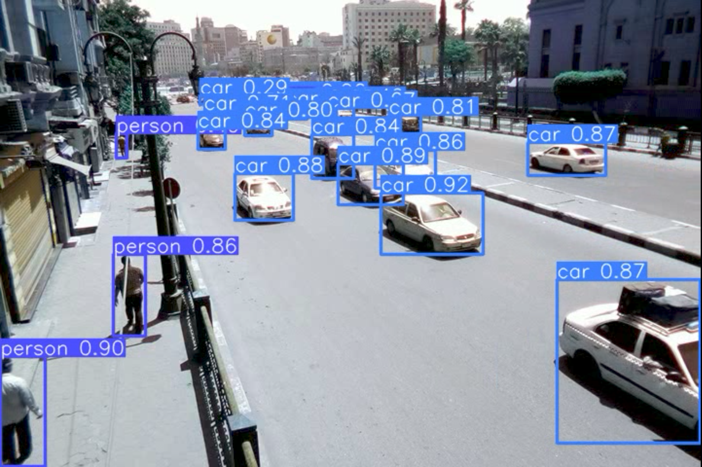

# YOLO Object Detection Benchmark

A reproducible benchmark comparing seven pretrained YOLO object-detection models on the same traffic video across CPU and GPU execution.

[View the executed notebook on Kaggle](https://www.kaggle.com/code/marioyouchia/yolo-object-detection-benchmark)

## Benchmark Scope

The following pretrained models are compared:

- YOLOv3u
- YOLOv5n-u
- YOLOv5s-u
- YOLOv5m-u
- YOLOv5l-u
- YOLOv5x-u
- YOLOv8n

Each model is executed once on the CPU and once on the GPU using the same input video and inference pipeline.

This project evaluates inference behavior and computational performance.

## Detection Preview



YOLOv5x-u detections on a traffic frame containing nearby and distant vehicles.

## Runtime Comparison


## Executed Results

The executed Kaggle notebook used:

- NVIDIA Tesla T4 GPU
- PyTorch 2.10.0 with CUDA 12.8
- 145 readable video frames
- 720 × 480 video resolution
- 25 FPS source frame rate

| Model | Total frame detections | CPU wall time (s) | CPU wall FPS | GPU wall time (s) | GPU wall FPS |
|---|---:|---:|---:|---:|---:|
| YOLOv3u | 2,614 | 202.80 | 0.71 | 10.99 | 13.20 |
| YOLOv5n-u | 2,272 | 12.07 | 12.01 | 3.31 | 43.83 |
| YOLOv5s-u | 2,428 | 25.14 | 5.77 | 3.49 | 41.53 |
| YOLOv5m-u | 2,583 | 56.86 | 2.55 | 4.48 | 32.34 |
| YOLOv5l-u | 2,668 | 107.64 | 1.35 | 6.60 | 21.97 |
| YOLOv5x-u | 2,719 | 183.81 | 0.79 | 10.59 | 13.69 |
| YOLOv8n | 2,483 | 12.44 | 11.65 | 3.36 | 43.11 |

### Main observations

- YOLOv5n-u achieved the highest measured GPU wall throughput at approximately 43.83 FPS.
- Larger models generally detected more objects but required more processing time.

## Measurements

The exported CSV includes:

- `model`: display name of the tested model
- `weight_reference`: pretrained weight filename
- `device`: CPU or GPU
- `frames`: number of processed frames
- `total_frame_detections`: total bounding boxes across all frames
- `model_time_seconds`: time reported by the model for preprocessing, inference, and postprocessing
- `wall_time_seconds`: complete elapsed processing time, including video reading, inference, annotation, and video writing
- `wall_fps`: processed frames divided by wall_time_seconds

## Running on Kaggle

1. Open the [executed Kaggle notebook](https://www.kaggle.com/code/marioyouchia/yolo-object-detection-benchmark).
2. Enable a GPU accelerator.
3. Set the benchmark configuration:

```python
RUN_CPU = True
RUN_GPU = True
MAX_FRAMES = None
SAVE_ANNOTATED_VIDEOS = True
```

## Output Files

A complete run produces:

- one annotated output video per model;
- `results/benchmark_results.csv`;
- a runtime-comparison chart.
